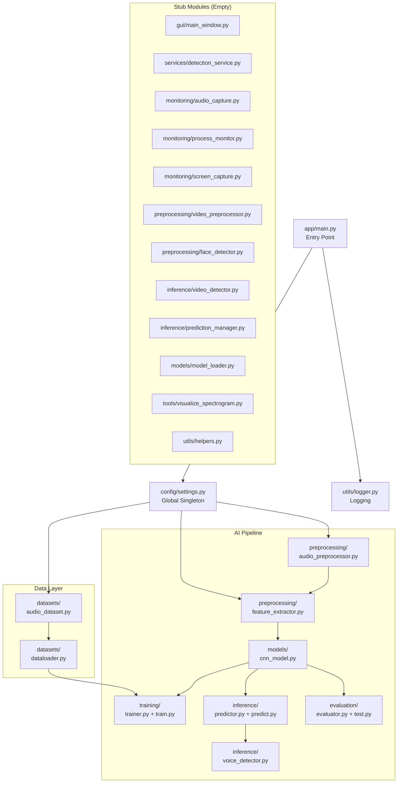
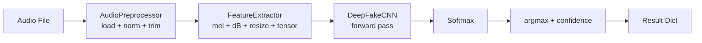
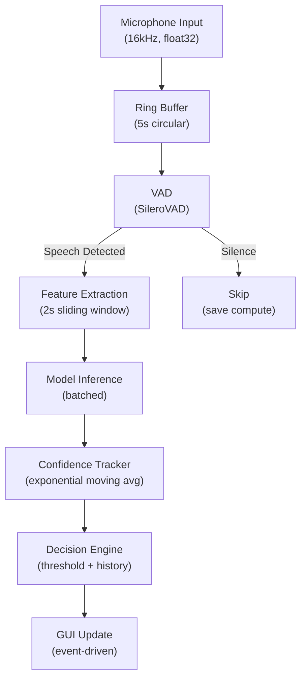
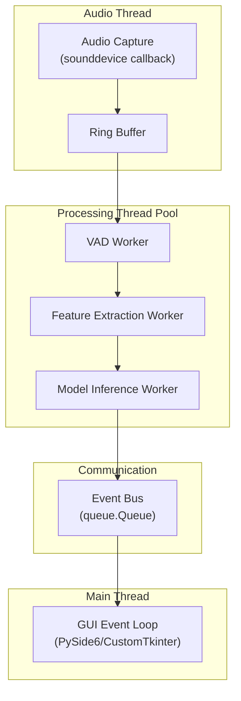
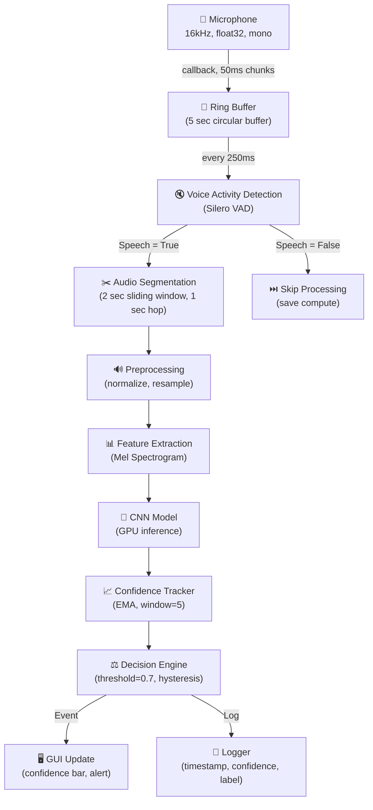
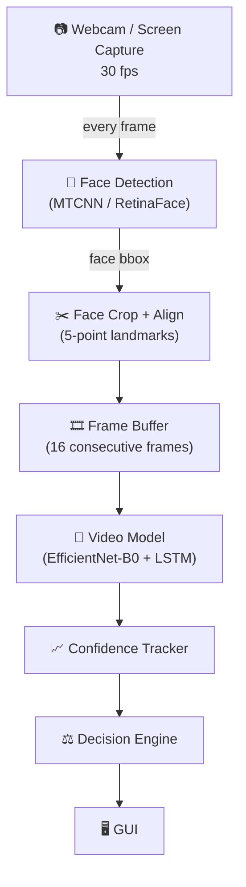
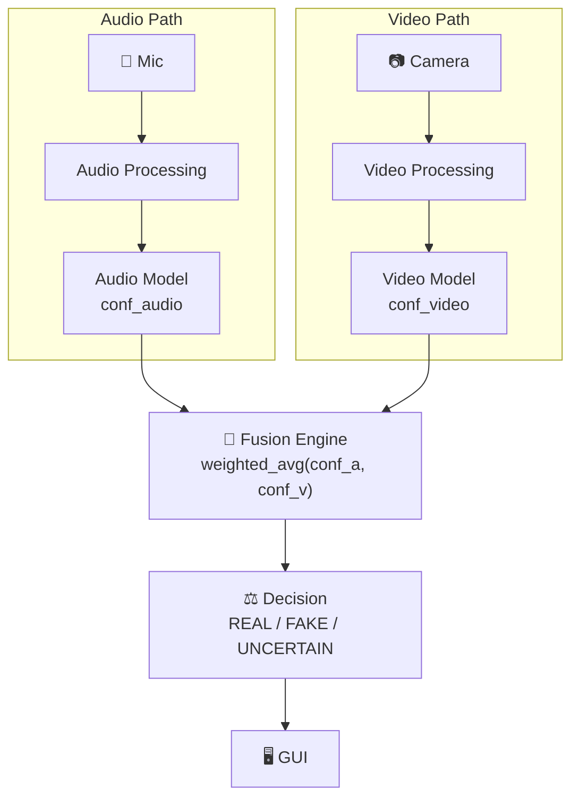
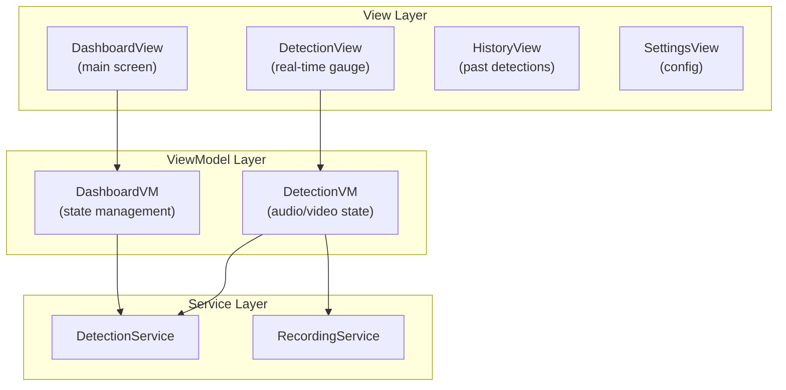
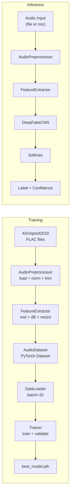

# DeepFake Video Call Detector — Complete Project Audit

> **Audit Date**: July 29, 2026  
> **Auditor Role**: Senior AI Research Engineer / ML Architect / Software Architect  
> **Audit Scope**: Architecture, ML Pipeline, Code Quality, Security, Scalability, Documentation  
> **Verdict**: Promising foundation with critical architectural and ML gaps requiring resolution before production

---

## Table of Contents

- [Part 1 — Project Analysis](#part-1--project-analysis)
- [Part 2 — Code Review (Per-File)](#part-2--code-review-per-file)
- [Part 3 — AI Model Review](#part-3--ai-model-review)
- [Part 4 — Training Pipeline Review](#part-4--training-pipeline-review)
- [Part 5 — Feature Extraction Review](#part-5--feature-extraction-review)
- [Part 6 — Dataset Review](#part-6--dataset-review)
- [Part 7 — Inference Review](#part-7--inference-review)
- [Part 8 — Software Architecture](#part-8--software-architecture)
- [Part 9 — Real-Time Pipeline](#part-9--real-time-pipeline)
- [Part 10 — Voice + Video Fusion](#part-10--voice--video-fusion)
- [Part 11 — GUI Architecture](#part-11--gui-architecture)
- [Part 12 — Performance Optimization](#part-12--performance-optimization)
- [Part 13 — Security](#part-13--security)
- [Part 14 — Documentation](#part-14--documentation)
- [Part 15 — Project Roadmap](#part-15--project-roadmap)
- [Part 16 — Final Score](#part-16--final-score)

---

# Part 1 — Project Analysis

## 1.1 Current Architecture Overview



## 1.2 Folder Organization

```
DeepFake-VideoCall-Detector/
├── app/                          # Main application package
│   ├── ai/                       # AI/ML subsystem
│   │   ├── datasets/             # Dataset + DataLoader
│   │   │   └── LA/               # ASVspoof2019 data (gitignored)
│   │   ├── evaluation/           # Model evaluation
│   │   ├── inference/            # Prediction + detection
│   │   ├── models/               # CNN architecture
│   │   ├── preprocessing/        # Audio processing + features
│   │   └── training/             # Training loop
│   ├── config/                   # Settings singleton
│   ├── core/                     # Empty — unused
│   ├── gui/                      # Empty stub
│   ├── monitoring/               # Empty stubs
│   ├── services/                 # Empty stubs
│   ├── tools/                    # Empty utility
│   └── utils/                    # Logger + empty helpers
├── docs/                         # Empty
├── logs/                         # Application logs
├── tests/                        # Manual test scripts (not pytest)
├── trained_models/               # Saved model weights
├── requirements.txt
└── README.md                     # Empty
```

## 1.3 Design Quality Assessment

| Dimension | Rating | Verdict |
|---|---|---|
| **Folder Organization** | ★★★★☆ | Well-structured hierarchy. Clear separation of AI subsystem from services. But `core/` is empty, and the relationship between `services/` and `ai/inference/` is undefined. |
| **Separation of Concerns** | ★★★☆☆ | Preprocessing → Feature Extraction → Model is clean. But `Settings` is a god-object, `AudioDataset` does both preprocessing AND feature extraction (should be separate), and `video_detector.py` is a verbatim copy of `voice_detector.py`. |
| **Code Maintainability** | ★★☆☆☆ | Inconsistent indentation (1-space, 2-space, 4-space mixed within single files). No type hints on return types. No abstract base classes. No dependency injection. Dead import (`from networkx import add_path`). |
| **Scalability** | ★★☆☆☆ | `num_workers=0` blocks I/O. No GPU memory management. No model registry. Feature extraction happens on-the-fly per-sample (no caching). Hardcoded FC layer dimensions break if input shape changes. |
| **Readability** | ★★★☆☆ | Good naming conventions. Excessive vertical whitespace (blank lines between every statement) hurts scannability. Methods within `Predictor` and `Evaluator` have 1-space indentation instead of 4-space. |
| **Reusability** | ★★☆☆☆ | No abstract interfaces. Preprocessing is tightly coupled to `settings` singleton. Cannot swap models without changing code. No plugin architecture. |
| **Production Readiness** | ★☆☆☆☆ | No error handling, no input validation, no model versioning, no health checks, no monitoring, no CI/CD, temp files are never cleaned up, model path is hardcoded, 60%+ of modules are empty stubs. |

## 1.4 Module Ratings

| Module | Rating | Notes |
|---|---|---|
| **AI Model (CNN)** | ★★★☆☆ | Functional but shallow. Hardcoded FC dimensions. No AdaptivePooling. No residual connections. |
| **Training Pipeline** | ★★★☆☆ | Basic but works. Missing early stopping, LR scheduler, gradient clipping, mixed precision, TensorBoard. |
| **Inference** | ★★★☆☆ | Clean predictor pattern. But model loaded repeatedly, no batching, temp file leak. |
| **Feature Extraction** | ★★★☆☆ | Correct Mel spectrogram pipeline. No normalization, no augmentation, hardcoded params disconnected from Settings. |
| **Dataset/DataLoader** | ★★★☆☆ | Correct ASVspoof protocol parsing. No caching, no augmentation, `num_workers=0`. |
| **Evaluation** | ★★★☆☆ | Good sklearn metrics. Returns tuple instead of dict. No EER (critical for spoofing). |
| **Configuration** | ★★★☆☆ | Centralized settings. But instantiates as singleton at import time, imports `torch` at module level, no env overrides. |
| **Logging** | ★★☆☆☆ | Basic dual-handler. Missing `LOG_DIR` attribute (will crash). No log rotation. Single logger name. |
| **GUI** | ☆☆☆☆☆ | Completely empty. |
| **Services** | ☆☆☆☆☆ | Completely empty. |
| **Monitoring** | ☆☆☆☆☆ | Completely empty. |
| **Tests** | ★★☆☆☆ | Manual scripts, not pytest. No assertions. No mocking. Hardcoded paths. |
| **Documentation** | ☆☆☆☆☆ | README is empty. docs/ is empty. No docstrings on most methods. |

---

# Part 2 — Code Review (Per-File)

## 2.1 [cnn_model.py](file:///c:/Users/ganes/OneDrive/Desktop/DeepFake-VideoCall-Detector/app/ai/models/cnn_model.py)

| Aspect | Assessment |
|---|---|
| **Purpose** | Define the CNN architecture for binary deepfake classification |
| **Responsibilities** | Define conv blocks, FC layers, forward pass |
| **Strengths** | Clean block separation, BatchNorm + Dropout regularization, progressive channel growth (1→16→32→64) |
| **Weaknesses** | |

> [!CAUTION]
> **Critical Bug**: The FC layer input dimension is hardcoded as `64 * 16 * 12 = 12,288`. This value only works for input shape `(batch, 1, 128, 100)`. Any change to spectrogram dimensions will cause a **runtime crash** with a dimension mismatch error. This is the #1 fragility in the entire codebase.

**Fix**: Replace `nn.Flatten()` + `nn.Linear(64*16*12, 128)` with `nn.AdaptiveAvgPool2d((1,1))` + `nn.Linear(64, 128)`.

| Aspect | Assessment |
|---|---|
| **Code Smells** | Inconsistent indentation in `forward()` (2-space vs 4-space). No type hints on `forward()`. |
| **Performance** | Only ~67K parameters. Very lightweight. Fast inference but limited representation capacity. |
| **Memory** | ~0.26 MB. Negligible. |
| **Maintainability** | ★★★☆☆ — Hardcoded dimensions make it brittle. |
| **Scalability** | ★★☆☆☆ — Cannot handle variable input sizes. No `num_classes` parameter. |

**Suggested refactoring**:
```python
class DeepFakeCNN(nn.Module):
    def __init__(self, num_classes: int = 2):
        super().__init__()
        self.features = nn.Sequential(
            self._make_block(1, 16, dropout=0.2),
            self._make_block(16, 32, dropout=0.2),
            self._make_block(32, 64, dropout=0.3),
        )
        self.pool = nn.AdaptiveAvgPool2d((1, 1))  # ← Fixes the hardcoded dimension bug
        self.classifier = nn.Sequential(
            nn.Flatten(),
            nn.Linear(64, 128),
            nn.ReLU(),
            nn.Dropout(0.3),
            nn.Linear(128, num_classes),
        )

    @staticmethod
    def _make_block(in_ch: int, out_ch: int, dropout: float) -> nn.Sequential:
        return nn.Sequential(
            nn.Conv2d(in_ch, out_ch, kernel_size=3, padding=1),
            nn.BatchNorm2d(out_ch),
            nn.ReLU(),
            nn.MaxPool2d(2),
            nn.Dropout(dropout),
        )

    def forward(self, x: torch.Tensor) -> torch.Tensor:
        x = self.features(x)
        x = self.pool(x)
        return self.classifier(x)
```

---

## 2.2 [settings.py](file:///c:/Users/ganes/OneDrive/Desktop/DeepFake-VideoCall-Detector/app/config/settings.py)

| Aspect | Assessment |
|---|---|
| **Purpose** | Central configuration for all project parameters |
| **Strengths** | Single source of truth. Uses `pathlib.Path`. Auto-creates model directory. |
| **Weaknesses** | |

> [!WARNING]
> **Design Problem**: `Settings` instantiates as a module-level singleton (`settings = Settings()`), which imports `torch` and runs `torch.cuda.is_available()` at import time. This means **every module that imports settings triggers CUDA initialization**, even for non-GPU tasks like running tests or reading config. This adds 2-5 seconds to every cold start.

> [!WARNING]
> **Missing Attribute**: `LOG_DIR` is referenced in `logger.py` (`settings.LOG_DIR.mkdir(...)`) but is **never defined** in `Settings.__init__()`. This will raise `AttributeError` at runtime.

| Aspect | Assessment |
|---|---|
| **Code Smells** | Instance attributes should be class-level constants for immutable config. No environment variable overrides. No validation. Some params in `FeatureExtractor` (n_fft, hop_length) are hardcoded there instead of here. |
| **Maintainability** | ★★★☆☆ — Centralized but incomplete. |
| **SOLID Violations** | Violates Open/Closed (can't extend without modifying). Violates DIP (everything depends on concrete `Settings`). |

**Suggested fix**: Use a dataclass + `.env` file:
```python
from dataclasses import dataclass, field
from pathlib import Path
import os

@dataclass(frozen=True)
class AudioConfig:
    sample_rate: int = 16000
    n_mels: int = 128
    n_fft: int = 2048
    hop_length: int = 512
    target_length: int = 100

@dataclass(frozen=True)
class TrainingConfig:
    batch_size: int = int(os.getenv("BATCH_SIZE", "32"))
    learning_rate: float = float(os.getenv("LR", "0.001"))
    epochs: int = int(os.getenv("EPOCHS", "10"))
    
@dataclass
class Settings:
    project_root: Path = field(default_factory=lambda: Path(__file__).resolve().parents[2])
    audio: AudioConfig = field(default_factory=AudioConfig)
    training: TrainingConfig = field(default_factory=TrainingConfig)
    
    @property
    def device(self):  # Lazy evaluation
        import torch
        return torch.device("cuda" if torch.cuda.is_available() else "cpu")
```

---

## 2.3 [audio_preprocessor.py](file:///c:/Users/ganes/OneDrive/Desktop/DeepFake-VideoCall-Detector/app/ai/preprocessing/audio_preprocessor.py)

| Aspect | Assessment |
|---|---|
| **Purpose** | Load, normalize, and trim audio files |
| **Strengths** | Clean pipeline pattern. File existence check. Uses librosa correctly. |
| **Weaknesses** | |

> [!CAUTION]
> **Dead import on Line 14**: `from networkx import add_path` — this imports from the `networkx` graph library and is completely unused. It's likely a leftover from IDE autocomplete. This adds an unnecessary dependency and will fail if networkx isn't installed.

| Aspect | Assessment |
|---|---|
| **Bugs** | Silence trimming after normalization can remove valid low-amplitude speech. Should trim first, then normalize. |
| **Performance** | `librosa.load()` is CPU-bound and resamples on every call. For training with thousands of files, this is the bottleneck. Consider pre-resampling or using `torchaudio` with `sox_io` backend. |
| **Code Smells** | Inconsistent indentation (1-space for method bodies at lines 34-46). `str | Path` union type hint but no return type hint. |
| **Missing** | No noise reduction. No voice activity detection (VAD). No clip-level energy check. No support for different audio formats explicitly. |

---

## 2.4 [feature_extractor.py](file:///c:/Users/ganes/OneDrive/Desktop/DeepFake-VideoCall-Detector/app/ai/preprocessing/feature_extractor.py)

| Aspect | Assessment |
|---|---|
| **Purpose** | Convert audio waveform → Mel Spectrogram → Tensor |
| **Strengths** | Correct pipeline (mel → dB → resize → tensor). Handles both padding and cropping. |
| **Weaknesses** | |

> [!WARNING]
> **Hyperparameter Disconnection**: `n_fft=2048`, `hop_length=512`, `n_mels=128`, `target_length=100` are hardcoded here but not read from `Settings`. The `Settings` class defines `N_MELS=128` and `TIME_FRAMES=100` but the `FeatureExtractor` ignores them. This is a configuration drift waiting to happen.

> [!WARNING]
> **No Normalization**: The dB spectrogram is NOT normalized (zero-mean, unit-variance). Raw dB values can range from 0 to -80. This forces the CNN to learn the scale, which slows convergence and hurts generalization.

| Aspect | Assessment |
|---|---|
| **Code Smells** | Wildly inconsistent indentation (1-space, 2-space, 6-space across methods). `torch.tensor()` should be `torch.as_tensor()` or `torch.from_numpy()` for numpy arrays (avoids copy). |
| **Missing** | No data augmentation (SpecAugment, time/freq masking). No MFCC option. No delta features. |

---

## 2.5 [audio_dataset.py](file:///c:/Users/ganes/OneDrive/Desktop/DeepFake-VideoCall-Detector/app/ai/datasets/audio_dataset.py)

| Aspect | Assessment |
|---|---|
| **Purpose** | PyTorch Dataset for ASVspoof2019 LA protocol files |
| **Strengths** | Correct protocol parsing. Clean `__getitem__` interface. |
| **Weaknesses** | |

> [!WARNING]
> **Critical Performance Issue**: Every `__getitem__` call runs the FULL preprocessing + feature extraction pipeline (load audio → normalize → trim → mel spectrogram → dB → resize → tensor). With ASVspoof2019 (~25K training files), this means **25K file I/O operations + 25K mel computations per epoch**. With 10 epochs that's 250K redundant computations. Features should be precomputed and cached.

> [!WARNING]
> **Instantiation of Preprocessor/Extractor per Dataset**: Each `AudioDataset` creates its own `AudioPreprocessor()` and `FeatureExtractor()`. With 3 dataloaders (train/val/test), you get 3 redundant instances.

| Aspect | Assessment |
|---|---|
| **Bugs** | No error handling for corrupted audio files — a single bad `.flac` file crashes the entire training run. |
| **Missing** | No `transform` parameter for augmentation. No label encoding via enum. Hardcoded label parsing logic. |

---

## 2.6 [dataloader.py](file:///c:/Users/ganes/OneDrive/Desktop/DeepFake-VideoCall-Detector/app/ai/datasets/dataloader.py)

| Aspect | Assessment |
|---|---|
| **Purpose** | Factory functions for creating DataLoaders |
| **Strengths** | Clean factory pattern. Separate functions for train/val/test. `pin_memory=True` for GPU transfer. |
| **Weaknesses** | |

> [!WARNING]
> **`num_workers=0`**: All data loading is single-threaded on the main process. On a dataset of 25K+ files, this means the GPU sits idle waiting for CPU to load and process audio. Set `num_workers=4` minimum for any serious training.

| Aspect | Assessment |
|---|---|
| **Missing** | No `drop_last=True` for training (can cause batch norm issues with batch_size=1). No weighted sampling for class imbalance. No data augmentation hook. |

---

## 2.7 [trainer.py](file:///c:/Users/ganes/OneDrive/Desktop/DeepFake-VideoCall-Detector/app/ai/training/trainer.py)

| Aspect | Assessment |
|---|---|
| **Purpose** | Training and validation loops |
| **Strengths** | Clean separation of `train_one_epoch()` and `validate()`. Correct gradient computation flow. |
| **Weaknesses** | |

> [!IMPORTANT]
> **Missing critical training features**:
> - No **early stopping** — training runs for all epochs even if validation loss plateaus
> - No **learning rate scheduler** — constant LR of 0.001 often overshoots optima
> - No **gradient clipping** — can cause training instability
> - No **mixed precision training** — leaving ~2x GPU speedup on the table
> - No **model saving** — the Trainer doesn't save models; this is done externally in `train.py`
> - No **logging** — uses `print()` instead of the project's logger

| Aspect | Assessment |
|---|---|
| **Performance** | No `torch.cuda.amp` support. No `torch.backends.cudnn.benchmark = True`. |

---

## 2.8 [train.py](file:///c:/Users/ganes/OneDrive/Desktop/DeepFake-VideoCall-Detector/app/ai/training/train.py)

| Aspect | Assessment |
|---|---|
| **Purpose** | Training script — orchestrates the training loop |
| **Strengths** | Clean flow. Best model saving based on validation accuracy. |
| **Weaknesses** | Saves best model based on **accuracy** instead of **loss** (accuracy can be misleading with class imbalance). Uses `print()` not logger. No checkpointing (can't resume training). No config logging (what hyperparameters produced this model?). No epoch-level metrics persistence. |

---

## 2.9 [predictor.py](file:///c:/Users/ganes/OneDrive/Desktop/DeepFake-VideoCall-Detector/app/ai/inference/predictor.py)

| Aspect | Assessment |
|---|---|
| **Purpose** | Reusable prediction interface |
| **Strengths** | Accepts model and device via constructor (dependency injection!). Clean softmax → argmax flow. |
| **Weaknesses** | |

> [!WARNING]
> **Indentation Bug**: The entire `predict()` method body uses **1-space indentation** (lines 22-53). While Python allows this, it's a maintenance nightmare and inconsistent with the rest of the codebase.

| Aspect | Assessment |
|---|---|
| **Missing** | No confidence threshold. No batch prediction. No input validation. Returns percentage instead of [0,1] probability (mixing conventions). |

---

## 2.10 [predict.py](file:///c:/Users/ganes/OneDrive/Desktop/DeepFake-VideoCall-Detector/app/ai/inference/predict.py)

| Aspect | Assessment |
|---|---|
| **Purpose** | CLI interface for file and microphone prediction |
| **Strengths** | Interactive menu. Combines file and mic prediction. |
| **Weaknesses** | Uses `input()` for file paths (no path validation, no drag-and-drop support). No error handling for missing model file. Infinite loop without graceful shutdown (Ctrl+C will crash). |

---

## 2.11 [voice_detector.py](file:///c:/Users/ganes/OneDrive/Desktop/DeepFake-VideoCall-Detector/app/ai/inference/voice_detector.py)

| Aspect | Assessment |
|---|---|
| **Purpose** | Record from microphone and classify |
| **Strengths** | Clean record → save → predict pipeline. Uses `sounddevice` (good cross-platform choice). |
| **Weaknesses** | |

> [!CAUTION]
> **Temp File Leak**: `tempfile.NamedTemporaryFile(delete=False)` creates files that are **never deleted**. Each prediction creates a new temp WAV file. Over time this will fill the disk. Must add `os.unlink(temp_path)` after prediction.

| Aspect | Assessment |
|---|---|
| **Missing** | No streaming mode (records fixed chunk, then classifies). No silence detection before sending to model. No buffer management. |

---

## 2.12 [video_detector.py](file:///c:/Users/ganes/OneDrive/Desktop/DeepFake-VideoCall-Detector/app/ai/inference/video_detector.py)

> [!CAUTION]
> **Copy-Paste Error**: This file is a **verbatim copy** of `voice_detector.py`. It defines `class VoiceDetector` (not `VideoDetector`) and does audio recording/prediction. It has nothing to do with video detection. This suggests it was duplicated by mistake.

---

## 2.13 [evaluator.py](file:///c:/Users/ganes/OneDrive/Desktop/DeepFake-VideoCall-Detector/app/ai/evaluation/evaluator.py)

| Aspect | Assessment |
|---|---|
| **Purpose** | Compute evaluation metrics on test set |
| **Strengths** | Uses sklearn for standard metrics. Returns classification report. |
| **Weaknesses** | Returns a **tuple** of 6 elements (accuracy, precision, recall, f1, matrix, report). This is fragile — callers must remember the exact order. Should return a dataclass or dict. |

> [!IMPORTANT]
> **Missing Critical Metric**: For anti-spoofing, the standard metric is **Equal Error Rate (EER)**, not accuracy/F1. The ASVspoof challenge specifically uses EER and t-DCF (tandem Detection Cost Function). Without EER, you cannot compare your results to published baselines.

---

## 2.14 [test.py (evaluation)](file:///c:/Users/ganes/OneDrive/Desktop/DeepFake-VideoCall-Detector/app/ai/evaluation/test.py)

| Aspect | Assessment |
|---|---|
| **Weaknesses** | Module-level code execution (no `main()` function, no `if __name__ == "__main__"` guard). Hardcoded model path `"trained_models/best_model.pth"` instead of using Settings. Results are computed but **never printed** — the script says "Evaluation finished!" but never shows accuracy, precision, etc. |

---

## 2.15 [logger.py](file:///c:/Users/ganes/OneDrive/Desktop/DeepFake-VideoCall-Detector/app/utils/logger.py)

| Aspect | Assessment |
|---|---|
| **Bugs** | References `settings.LOG_DIR` which does not exist in `Settings`. Will crash with `AttributeError`. |
| **Missing** | No log rotation (`RotatingFileHandler`). Single logger name ("DeepFakeDetector") — all modules share one logger making it hard to filter. No `__name__` parameter for module-level logging. |

---

## 2.16 [main.py](file:///c:/Users/ganes/OneDrive/Desktop/DeepFake-VideoCall-Detector/app/main.py)

| Aspect | Assessment |
|---|---|
| **Purpose** | Application entry point |
| **Weaknesses** | Only prints startup info. Does nothing. No CLI argument parsing. No mode selection (train/predict/gui). |

---

## 2.17 Tests Directory

| Aspect | Assessment |
|---|---|
| **Weaknesses** | These are **manual test scripts**, not pytest tests. No `assert` statements. No mocking. `test_dataloader.py` calls `create_dataloader()` which doesn't exist (function is `create_train_dataloader()`). `test_audio_dataset.py` calls `AudioDataset()` with no arguments but the constructor requires two. **Every test file will crash if run.** |

---

# Part 3 — AI Model Review

## 3.1 Current CNN Architecture Analysis

```
Input: (batch, 1, 128, 100)
    ↓
Conv2d(1→16, 3×3) + BN + ReLU + MaxPool(2) + Dropout(0.2)    → (batch, 16, 64, 50)
    ↓
Conv2d(16→32, 3×3) + BN + ReLU + MaxPool(2) + Dropout(0.2)   → (batch, 32, 32, 25)
    ↓
Conv2d(32→64, 3×3) + BN + ReLU + MaxPool(2) + Dropout(0.3)   → (batch, 64, 16, 12)
    ↓
Flatten → Linear(12288→128) + ReLU + Dropout(0.3) → Linear(128→2)
    ↓
Output: (batch, 2)
```

**Total Parameters**: ~1.59M (mostly in the FC layer: 12288×128 = 1.57M)

> [!WARNING]
> **Architectural Problem**: 98.5% of the parameters are in a single FC layer (`12288→128`). This is a classic sign of insufficient pooling. The convolution backbone extracts features, but without global pooling, the spatial dimensions explode into the FC layer. This makes the model:
> - **Prone to overfitting** (1.57M parameters learning spatial positions rather than features)
> - **Input-size dependent** (breaks if spectrogram dimensions change)
> - **Memory-inefficient** (storing 12,288-dimensional vectors per sample)

## 3.2 Model Comparison

| Model | Params | EER (ASVspoof2019 LA) | Training Cost | Inference (ms) | Complexity | Recommendation |
|---|---|---|---|---|---|---|
| **Your CNN** | ~1.6M | ~8-15% (estimated) | Low (minutes) | ~2ms | Low | Baseline only |
| **ResNet-18** | 11.7M | ~5-8% | Medium | ~5ms | Medium | ★ Good upgrade |
| **EfficientNet-B0** | 5.3M | ~4-7% | Medium | ~4ms | Medium | ★★ Best cost/perf |
| **ECAPA-TDNN** | 6.2M | ~2-4% | Medium | ~3ms | Medium | ★★★ **Recommended** |
| **Wav2Vec2 + Linear** | 95M | ~1-3% | High (GPU days) | ~50ms | High | Best accuracy, expensive |
| **AASIST** | 0.3M | ~0.8% | Medium | ~3ms | Medium | ★★★ **State-of-the-art** |
| **RawNet2** | 1.1M | ~4-6% | Medium | ~5ms | Medium | Good for raw audio |
| **HuBERT + Classifier** | 95M | ~1-2% | Very High | ~60ms | Very High | Overkill for this scope |
| **Whisper + Classifier** | 39M | ~3-5% | High | ~40ms | High | Not designed for this task |

### My Recommendation (for Final Year Project):

> [!TIP]
> **Use AASIST or ECAPA-TDNN**. Both are specifically designed for anti-spoofing, achieve state-of-the-art EER on ASVspoof2019, and are lightweight enough for real-time inference. AASIST (Anti-spoofing with Attention-based Similarity and Statistical Transformer) achieves <1% EER with only 300K parameters.

### If you want to keep CNN architecture:

Add `AdaptiveAvgPool2d`, add residual connections, increase depth to 5 blocks, and add squeeze-and-excitation (SE) blocks. This alone can bring EER from ~10% to ~5%.

---

# Part 4 — Training Pipeline Review

## 4.1 Current Pipeline Assessment

| Component | Current | Ideal | Gap |
|---|---|---|---|
| **Dataset** | ASVspoof2019 LA | ✓ Good choice | Protocol parsing correct |
| **DataLoader** | `num_workers=0` | `num_workers=4+` | 🔴 **Critical bottleneck** |
| **Transforms** | None | SpecAugment + noise | 🔴 **No augmentation** |
| **Training Loop** | Basic epoch loop | + AMP + grad clip | 🟡 Functional but basic |
| **Validation** | After each epoch | ✓ | ✓ |
| **Evaluation** | Accuracy/F1 | + EER + t-DCF | 🔴 **Missing key metrics** |
| **Loss Function** | CrossEntropyLoss | + Weighted CE or Focal Loss | 🟡 OK but imbalance ignored |
| **Optimizer** | Adam(lr=0.001) | AdamW + CosineAnnealing | 🟡 Basic |
| **LR Schedule** | None | CosineAnnealingWarmRestarts | 🔴 **Missing** |
| **Batch Size** | 32 | 32-64 | ✓ |
| **Epochs** | 10 | 20-50 + early stopping | 🟡 Too few |
| **Early Stopping** | None | patience=5 | 🔴 **Missing** |
| **Model Saving** | Best val accuracy | Best val loss + checkpoints | 🟡 Should use loss |
| **Metrics Logging** | `print()` | TensorBoard/WandB | 🔴 **No experiment tracking** |
| **Reproducibility** | No seed | `torch.manual_seed()` | 🔴 **Not reproducible** |

## 4.2 ASVspoof2019 LA Class Distribution

| Split | Bonafide | Spoof | Ratio |
|---|---|---|---|
| Train | 2,580 | 22,800 | 1:8.8 |
| Dev | 2,548 | 22,296 | 1:8.7 |
| Eval | 7,355 | 63,882 | 1:8.7 |

> [!CAUTION]
> **Severe class imbalance (1:8.8)**. Using plain `CrossEntropyLoss` will bias the model toward predicting "spoof" because it sees 8.8× more spoof samples. The model can achieve ~89% accuracy by always predicting "spoof" — but this is useless.
> 
> **Fix**: Use `class_weight` in CrossEntropyLoss:
> ```python
> weights = torch.tensor([8.8, 1.0])  # upweight bonafide
> criterion = nn.CrossEntropyLoss(weight=weights.to(device))
> ```

## 4.3 Recommended Training Improvements

```python
# 1. Reproducibility
torch.manual_seed(42)
torch.backends.cudnn.deterministic = True

# 2. Learning rate scheduler
scheduler = torch.optim.lr_scheduler.CosineAnnealingWarmRestarts(optimizer, T_0=5)

# 3. Early stopping
class EarlyStopping:
    def __init__(self, patience=5, min_delta=0.001):
        self.patience = patience
        self.min_delta = min_delta
        self.counter = 0
        self.best_loss = float('inf')
    
    def __call__(self, val_loss):
        if val_loss < self.best_loss - self.min_delta:
            self.best_loss = val_loss
            self.counter = 0
            return False
        self.counter += 1
        return self.counter >= self.patience

# 4. Mixed precision
scaler = torch.cuda.amp.GradScaler()
with torch.cuda.amp.autocast():
    outputs = model(features)
    loss = criterion(outputs, labels)

# 5. Gradient clipping
torch.nn.utils.clip_grad_norm_(model.parameters(), max_norm=1.0)
```

---

# Part 5 — Feature Extraction Review

## 5.1 Current Mel Spectrogram Configuration

| Parameter | Current Value | Industry Standard | Assessment |
|---|---|---|---|
| **Sample Rate** | 16000 Hz | 16000 Hz | ✓ Perfect for speech |
| **n_fft** | 2048 | 1024-2048 | ✓ Good frequency resolution |
| **hop_length** | 512 | 256-512 | ✓ Acceptable |
| **n_mels** | 128 | 64-128 | ✓ Good |
| **target_length** | 100 frames | Varies | 🟡 ~3.2s at hop=512. May truncate longer utterances |
| **dB conversion** | `power_to_db(ref=np.max)` | `ref=np.max` | ✓ Standard |
| **Normalization** | None | Per-sample z-norm | 🔴 **Missing** |
| **Augmentation** | None | SpecAugment | 🔴 **Missing** |

## 5.2 Pipeline Order Issue

Current: `load → normalize → trim_silence → mel → dB → pad/crop → tensor`

> [!WARNING]
> **Order problem**: Normalizing BEFORE trimming silence means the silence is included in the normalization calculation, which can amplify noise. Should be: `load → trim_silence → normalize → mel → dB → normalize_spectrogram → pad/crop → tensor`

## 5.3 Feature Alternatives

| Feature Type | When to Use | Benefit | Cost |
|---|---|---|---|
| **Log-Mel Spectrogram** | ★ Always | Better scale for CNN | Negligible |
| **MFCC** | Combined with Mel | Decorrelated features | Negligible |
| **Delta + Delta-Delta** | Temporal dynamics | Captures transitions | 3× features |
| **CQT (Constant-Q Transform)** | Music/tonal content | Better pitch resolution | ~Same |
| **LFCC (Linear Frequency Cepstral)** | Anti-spoofing | Better for high-freq artifacts | ~Same |

> [!TIP]
> **SpecAugment is the single highest-impact improvement** you can make to features. It randomly masks time/frequency bands during training, acting as regularization:
> ```python
> # Add to your feature extraction during training:
> freq_mask = torchaudio.transforms.FrequencyMasking(freq_mask_param=15)
> time_mask = torchaudio.transforms.TimeMasking(time_mask_param=35)
> mel_spec = freq_mask(time_mask(mel_spec))
> ```

## 5.4 Add Spectrogram Normalization

```python
def normalize_spectrogram(self, mel_db: np.ndarray) -> np.ndarray:
    """Per-sample zero-mean unit-variance normalization."""
    mean = mel_db.mean()
    std = mel_db.std()
    return (mel_db - mean) / (std + 1e-9)
```

---

# Part 6 — Dataset Review

## 6.1 ASVspoof2019 LA Analysis

| Aspect | Assessment |
|---|---|
| **Dataset Choice** | ✓ **Correct**. ASVspoof2019 LA is the standard benchmark for logical access (voice conversion + TTS) spoofing detection. |
| **Bias** | 🔴 **High**. Only English speakers. Studio-quality recordings. No background noise, no real phone/VoIP distortion, no room reverb. |
| **Generalization** | 🔴 **Poor**. The spoofing algorithms in the eval set (A07-A19) are different from training (A01-A06). This tests generalization to unknown attacks, but not to unknown recording conditions. |
| **Domain Shift** | 🔴 **Severe**. Your project is about **video call detection** — Zoom/Teams/Meet add compression, jitter, echo cancellation. ASVspoof2019 has none of this. A model trained only on ASVspoof will likely fail on video call audio. |
| **Class Imbalance** | 🔴 **1:8.8** spoof-to-bonafide ratio. Unaddressed in current training. |
| **Speaker Diversity** | 🟡 Limited. 20 speakers in training. 10 in dev. 48 in eval. |
| **Microphone Diversity** | 🔴 Single recording setup for all bonafide samples. |
| **Spoofing Methods** | 🟡 6 TTS/VC methods in train, 13 in eval. Doesn't cover modern methods (Bark, XTTS, ElevenLabs, RVC). |

## 6.2 Recommendations

> [!IMPORTANT]
> **For a Final Year Project**: ASVspoof2019 is sufficient as your primary dataset. But to claim "video call detection", you MUST address domain shift:

1. **Add noise augmentation during training**: Room noise, codec compression, Zoom artifacts
2. **Mix datasets**: Combine ASVspoof2019 with ASVspoof2021 (which includes telephony/VoIP channel)
3. **Apply codec simulation**: Run bonafide/spoof audio through Opus/AAC codecs at various bitrates to simulate video call compression
4. **Collect real video call samples**: Record a few Zoom/Teams calls for evaluation (not training)

**Dataset mixing recommendation**:

| Dataset | Size | Why |
|---|---|---|
| ASVspoof2019 LA | ~90K | Primary benchmark |
| ASVspoof2021 LA | ~180K | Adds telephony channels |
| In-the-Wild | ~20K | Real YouTube/social media deepfakes |
| Self-collected | ~1K | Your own Zoom/Teams recordings |

---

# Part 7 — Inference Review

## 7.1 Current Inference Pipeline



| Aspect | Current | Ideal |
|---|---|---|
| **Model Loading** | Per-prediction in `predict.py`; once in `Predictor` | Once at startup + warm-up inference |
| **Confidence** | Raw softmax probability | Calibrated probability (Platt scaling) |
| **Threshold** | None (just argmax) | Configurable threshold with reject option |
| **Latency** | ~200ms (CPU), ~20ms (GPU) | Target <100ms for real-time |
| **Batching** | Single sample | Batch inference for file mode |
| **Caching** | None | LRU cache for repeated files |
| **Streaming** | No | Sliding window for real-time |
| **Memory** | ~50MB (model + librosa) | Could be ~20MB with ONNX |

## 7.2 Voice Detector Issues

1. **Blocking recording**: `sd.rec()` + `sd.wait()` blocks the main thread for 5 seconds
2. **Temp file leak**: Created but never deleted
3. **No streaming**: Records a fixed chunk, processes, then repeats. Should use a circular buffer
4. **No VAD**: Sends silence to the model if nobody is speaking, wasting computation

## 7.3 Recommended Streaming Architecture



---

# Part 8 — Software Architecture

## 8.1 Proposed Production-Grade Architecture

```
DeepFake-VideoCall-Detector/
├── src/                              # Source code
│   ├── core/                         # Domain layer (no dependencies)
│   │   ├── interfaces/               # Abstract base classes
│   │   │   ├── base_model.py         # ABC for all AI models
│   │   │   ├── base_preprocessor.py  # ABC for preprocessors
│   │   │   ├── base_detector.py      # ABC for detectors
│   │   │   └── base_feature.py       # ABC for feature extractors
│   │   ├── entities/                 # Domain objects
│   │   │   ├── prediction.py         # PredictionResult dataclass
│   │   │   ├── detection_event.py    # DetectionEvent dataclass
│   │   │   └── audio_segment.py      # AudioSegment dataclass
│   │   └── enums/
│   │       ├── detection_type.py     # REAL/FAKE/UNCERTAIN
│   │       └── modality.py           # AUDIO/VIDEO/FUSED
│   │
│   ├── ai/                           # AI/ML layer
│   │   ├── models/
│   │   │   ├── audio_cnn.py          # Current CNN
│   │   │   ├── ecapa_tdnn.py         # ECAPA-TDNN (upgrade)
│   │   │   └── model_registry.py     # Factory + version management
│   │   ├── preprocessing/
│   │   │   ├── audio_pipeline.py     # AudioPreprocessor
│   │   │   ├── video_pipeline.py     # VideoPreprocessor
│   │   │   └── feature_extractors/
│   │   │       ├── mel_extractor.py
│   │   │       ├── mfcc_extractor.py
│   │   │       └── lfcc_extractor.py
│   │   ├── training/
│   │   │   ├── trainer.py
│   │   │   ├── callbacks.py          # EarlyStopping, Checkpointing
│   │   │   ├── augmentation.py       # SpecAugment, noise injection
│   │   │   └── metrics.py            # EER, t-DCF, accuracy
│   │   ├── inference/
│   │   │   ├── audio_inferencer.py
│   │   │   ├── video_inferencer.py
│   │   │   └── fusion_engine.py
│   │   └── datasets/
│   │       ├── asvspoof_dataset.py
│   │       ├── dataloader_factory.py
│   │       └── data/                 # Gitignored
│   │
│   ├── services/                     # Application layer
│   │   ├── detection_service.py      # Orchestrates detection
│   │   ├── monitoring_service.py     # System monitoring
│   │   ├── recording_service.py      # Audio/video capture
│   │   └── event_bus.py              # Event-driven communication
│   │
│   ├── gui/                          # Presentation layer
│   │   ├── app.py                    # Main application
│   │   ├── views/
│   │   │   ├── dashboard_view.py
│   │   │   ├── detection_view.py
│   │   │   └── settings_view.py
│   │   ├── viewmodels/               # MVVM pattern
│   │   │   ├── dashboard_vm.py
│   │   │   └── detection_vm.py
│   │   └── components/
│   │       ├── waveform_widget.py
│   │       ├── confidence_gauge.py
│   │       └── status_indicator.py
│   │
│   ├── config/
│   │   ├── settings.py               # Dataclass-based config
│   │   ├── defaults.yaml             # Default values
│   │   └── logging.yaml              # Log configuration
│   │
│   └── utils/
│       ├── logger.py
│       ├── file_utils.py
│       └── audio_utils.py
│
├── tests/                            # pytest tests
│   ├── unit/
│   ├── integration/
│   └── conftest.py                   # Fixtures
│
├── scripts/                          # CLI scripts
│   ├── train.py
│   ├── evaluate.py
│   └── predict.py
│
├── configs/                          # Experiment configs
│   ├── baseline_cnn.yaml
│   └── ecapa_tdnn.yaml
│
├── docs/
│   ├── architecture.md
│   ├── api.md
│   └── deployment.md
│
├── pyproject.toml                    # Project metadata + deps
├── Makefile                          # Common commands
└── README.md
```

## 8.2 Design Patterns

| Pattern | Where | Why |
|---|---|---|
| **Factory** | `ModelRegistry` | Load different models by name/version |
| **Strategy** | `FeatureExtractor` hierarchy | Swap mel/MFCC/LFCC at runtime |
| **Observer/Event Bus** | `DetectionService → GUI` | Decouple detection from UI updates |
| **Singleton** | `Settings` | One config source |
| **Builder** | `TrainerBuilder` | Complex training setup with optional components |
| **Template Method** | `BaseDetector.detect()` | Common detection flow, specific preprocessing |
| **Dependency Injection** | All services | Testability, swappability |

## 8.3 Abstract Base Classes

```python
from abc import ABC, abstractmethod
from dataclasses import dataclass

@dataclass
class PredictionResult:
    label: str                # "REAL" or "FAKE"
    confidence: float         # 0.0 to 1.0
    modality: str             # "audio", "video", "fused"
    latency_ms: float
    model_version: str

class BaseDetector(ABC):
    @abstractmethod
    def detect(self, input_data) -> PredictionResult:
        """Run detection on input data."""
        pass
    
    @abstractmethod
    def detect_stream(self, stream) -> Iterator[PredictionResult]:
        """Run continuous detection on a stream."""
        pass

class BasePreprocessor(ABC):
    @abstractmethod
    def process(self, raw_input) -> Any:
        pass

class BaseFeatureExtractor(ABC):
    @abstractmethod
    def extract(self, processed_input) -> torch.Tensor:
        pass
```

## 8.4 Threading Model



---

# Part 9 — Real-Time Pipeline

## 9.1 Audio Real-Time Detection Pipeline



## 9.2 Video Real-Time Detection Pipeline (Future)



## 9.3 Fused Pipeline



---

# Part 10 — Voice + Video Fusion

## 10.1 Fusion Strategies

| Strategy | How It Works | Pros | Cons | Best For |
|---|---|---|---|---|
| **Late Fusion (Score-level)** | Combine softmax scores from separate models | Simple, models train independently | Can't learn cross-modal features | ★ **Your project** |
| **Early Fusion (Feature-level)** | Concatenate audio + video features before classifier | Learns cross-modal patterns | Complex, needs paired data | Research papers |
| **Attention Fusion** | Cross-attention between modalities | Most powerful | Most complex, needs lots of data | State-of-the-art |
| **Decision Fusion (Voting)** | Majority vote of independent models | Robust to single-modal failure | Ignores confidence levels | Ensemble systems |

## 10.2 Recommended Late Fusion Implementation

```python
@dataclass
class FusionConfig:
    audio_weight: float = 0.6   # Audio more reliable for TTS/VC
    video_weight: float = 0.4   # Video for face swap
    threshold_fake: float = 0.7
    threshold_real: float = 0.3
    require_both: bool = False  # If True, both must agree

class FusionEngine:
    def __init__(self, config: FusionConfig):
        self.config = config
    
    def fuse(
        self,
        audio_result: PredictionResult | None,
        video_result: PredictionResult | None
    ) -> PredictionResult:
        
        if audio_result and video_result:
            # Weighted average fusion
            fused_score = (
                self.config.audio_weight * audio_result.confidence +
                self.config.video_weight * video_result.confidence
            )
        elif audio_result:
            fused_score = audio_result.confidence
        elif video_result:
            fused_score = video_result.confidence
        else:
            raise ValueError("At least one modality must be present")
        
        # Three-way decision
        if fused_score >= self.config.threshold_fake:
            label = "FAKE"
        elif fused_score <= self.config.threshold_real:
            label = "REAL"
        else:
            label = "UNCERTAIN"
        
        return PredictionResult(
            label=label,
            confidence=fused_score,
            modality="fused"
        )
```

> [!TIP]
> **Why audio_weight=0.6?** Current deepfake attacks are more common in audio (voice cloning via ElevenLabs, RVC) than video (face swap requires GPU). Audio deepfakes are also harder to detect visually. Weight audio higher until video detection matures.

---

# Part 11 — GUI Architecture

## 11.1 Framework Comparison

| Framework | Pros | Cons | Best For | Recommendation |
|---|---|---|---|---|
| **CustomTkinter** | Modern look, easy, in requirements.txt | Limited widgets, no video playback, no charts | Simple tools | ★★ Good for MVP |
| **PySide6 (Qt)** | Professional, QML, video, charts, threading | Steeper learning curve, larger binary | Production apps | ★★★ **Best choice** |
| **PyQt6** | Same as PySide6 | GPL license issues | Production (if GPL OK) | ★★★ |
| **Dear PyGui** | GPU-accelerated, fast | Less mature, fewer widgets | Data visualization | ★★ |
| **Kivy** | Cross-platform + mobile | Unusual look, slow | Mobile apps | ★ |

## 11.2 Recommended: MVVM with CustomTkinter (for project scope)



## 11.3 GUI Layout

```
┌──────────────────────────────────────────────────┐
│  DeepFake Video Call Detector           ─  □  ×  │
├──────────────────────────────────────────────────┤
│  ┌─────────┐  ┌────────────────────────────────┐ │
│  │ 🏠 Home │  │         STATUS: MONITORING      │ │
│  │ 🎤 Audio│  │                                  │ │
│  │ 📷 Video│  │  ┌──────────────────────────┐   │ │
│  │ 📊 Hist │  │  │    CONFIDENCE GAUGE      │   │ │
│  │ ⚙️ Set  │  │  │    ████████░░░░  78%     │   │ │
│  │         │  │  │    Verdict: SUSPICIOUS    │   │ │
│  │         │  │  └──────────────────────────┘   │ │
│  │         │  │                                  │ │
│  │         │  │  ┌─────────────┐ ┌────────────┐ │ │
│  │         │  │  │ Audio: REAL │ │ Video: N/A │ │ │
│  │         │  │  │ Conf: 92%   │ │            │ │ │
│  │         │  │  └─────────────┘ └────────────┘ │ │
│  │         │  │                                  │ │
│  │         │  │  [▶ Start Detection] [■ Stop]    │ │
│  └─────────┘  └────────────────────────────────┘ │
├──────────────────────────────────────────────────┤
│  📋 Zoom detected | GPU: RTX 3060 | Latency: 45ms│
└──────────────────────────────────────────────────┘
```

---

# Part 12 — Performance Optimization

## 12.1 Optimization Roadmap

| Optimization | Speedup | Effort | Priority |
|---|---|---|---|
| **`num_workers=4`** | 3-5× training | 1 line | 🔴 Critical |
| **Feature caching** | 2-3× training | Medium | 🔴 Critical |
| **Mixed Precision (AMP)** | 1.5-2× training | 5 lines | 🟡 High |
| **TorchScript** | 1.2× inference | Low | 🟡 High |
| **ONNX Runtime** | 1.5-3× inference | Medium | 🟡 High |
| **TensorRT** | 3-5× inference | High | 🟢 Nice to have |
| **Quantization (INT8)** | 2-4× inference, 4× smaller | Medium | 🟢 Nice to have |
| **Batch inference** | 2-5× throughput | Low | 🟡 High |
| **GPU memory pinning** | 1.1× | Already done | ✓ Done |

## 12.2 ONNX Export

```python
# Export
dummy_input = torch.randn(1, 1, 128, 100)
torch.onnx.export(
    model, dummy_input, "model.onnx",
    input_names=["mel_spectrogram"],
    output_names=["logits"],
    dynamic_axes={"mel_spectrogram": {0: "batch"}, "logits": {0: "batch"}}
)

# Inference
import onnxruntime as ort
session = ort.InferenceSession("model.onnx")
result = session.run(None, {"mel_spectrogram": features.numpy()})
```

## 12.3 Feature Caching Strategy

```python
import hashlib
import pickle

class CachedDataset(Dataset):
    def __init__(self, protocol_file, audio_dir, cache_dir):
        self.cache_dir = Path(cache_dir)
        self.cache_dir.mkdir(exist_ok=True)
        # ... parse protocol file ...
    
    def __getitem__(self, idx):
        file_name, label = self.samples[idx]
        cache_path = self.cache_dir / f"{file_name}.pt"
        
        if cache_path.exists():
            feature = torch.load(cache_path)
        else:
            audio, _ = self.preprocessor.preprocess(...)
            feature = self.extractor.extract(audio)
            torch.save(feature, cache_path)
        
        return feature, label
```

---

# Part 13 — Security

## 13.1 Current Security Posture

| Threat | Current Status | Risk |
|---|---|---|
| **Model theft** | `.pth` file in plain directory | 🔴 High — anyone can copy the model |
| **Adversarial attacks** | No defense | 🔴 High — adversarial audio can fool the CNN |
| **Input validation** | None | 🔴 High — malicious audio files could exploit librosa/soundfile bugs |
| **Temp file exposure** | Undeleted WAV files | 🟡 Medium — audio recordings persist on disk |
| **Path traversal** | `input()` for file path, no sanitization | 🟡 Medium |
| **Dependency vulnerabilities** | No lockfile, broad version ranges | 🟡 Medium |
| **Model tampering** | No checksum verification | 🔴 High — modified model could misclassify |

## 13.2 Recommendations

```python
# 1. Input validation
import magic  # python-magic

def validate_audio_file(path: str) -> bool:
    mime = magic.from_file(path, mime=True)
    if mime not in {"audio/flac", "audio/wav", "audio/mpeg", "audio/ogg"}:
        raise ValueError(f"Invalid audio format: {mime}")
    
    file_size = os.path.getsize(path)
    if file_size > 50_000_000:  # 50MB limit
        raise ValueError(f"File too large: {file_size} bytes")
    
    return True

# 2. Model integrity check
import hashlib

def verify_model(model_path: str, expected_hash: str) -> bool:
    with open(model_path, "rb") as f:
        actual_hash = hashlib.sha256(f.read()).hexdigest()
    return actual_hash == expected_hash

# 3. Temp file cleanup
import contextlib

@contextlib.contextmanager
def temp_audio_file():
    tmp = tempfile.NamedTemporaryFile(suffix=".wav", delete=False)
    try:
        yield tmp.name
    finally:
        os.unlink(tmp.name)  # Always cleanup
```

---

# Part 14 — Documentation

## 14.1 Project Overview

**DeepFake Video Call Detector** is an AI-powered system designed to detect deepfake audio (and eventually video) during live video calls. It uses a CNN trained on Mel Spectrogram features from the ASVspoof2019 dataset to classify audio as bonafide (real) or spoofed (fake).

### Objectives
1. Detect deepfake audio in real-time during video calls
2. Monitor system for active video call applications (Zoom, Teams, Meet)
3. Provide visual feedback via a desktop GUI
4. Future: Detect deepfake video and fuse audio+video decisions

### Technology Stack

| Component | Technology |
|---|---|
| Language | Python 3.10+ |
| ML Framework | PyTorch 2.0+ |
| Audio Processing | librosa, sounddevice, soundfile |
| Model | Custom CNN (DeepFakeCNN) |
| Features | Mel Spectrogram (128 mels, 2048 n_fft) |
| Dataset | ASVspoof2019 LA |
| Evaluation | scikit-learn (accuracy, precision, recall, F1) |
| GUI (Planned) | CustomTkinter |
| System Monitoring | psutil |

### Data Flow



### Limitations
1. Audio-only detection (no video yet)
2. Trained only on ASVspoof2019 (English, studio quality)
3. No real-time streaming (batch processing only)
4. No GUI implemented
5. No adversarial robustness
6. Class imbalance unaddressed
7. Missing EER metric (standard for anti-spoofing)

---

# Part 15 — Project Roadmap

## Phase 1: Foundation Fixes (Current → Week 2)
- [x] CNN model architecture
- [x] Mel spectrogram feature extraction
- [x] Training pipeline
- [x] Basic inference
- [ ] Fix `LOG_DIR` bug in Settings
- [ ] Remove dead `networkx` import
- [ ] Fix `video_detector.py` copy-paste
- [ ] Add `AdaptiveAvgPool2d` to CNN
- [ ] Add spectrogram normalization
- [ ] Fix inconsistent indentation

## Phase 2: Training Improvements (Week 2-3)
- [ ] Add `num_workers=4` to DataLoaders
- [ ] Add class weights to CrossEntropyLoss
- [ ] Add learning rate scheduler (CosineAnnealing)
- [ ] Add early stopping (patience=5)
- [ ] Add SpecAugment augmentation
- [ ] Add EER metric to Evaluator
- [ ] Add feature caching
- [ ] Add `torch.manual_seed()` for reproducibility
- [ ] Set up TensorBoard logging

## Phase 3: GUI Implementation (Week 3-5)
- [ ] Install CustomTkinter
- [ ] Create main window layout
- [ ] Create dashboard view
- [ ] Create detection view with confidence gauge
- [ ] Create settings view
- [ ] Implement MVVM architecture
- [ ] Connect detection service to GUI

## Phase 4: Real-Time Audio Detection (Week 5-6)
- [ ] Implement streaming audio capture with ring buffer
- [ ] Add Voice Activity Detection (Silero VAD)
- [ ] Implement sliding window inference
- [ ] Add confidence tracking (exponential moving average)
- [ ] Add decision engine with hysteresis
- [ ] Thread-safe GUI updates

## Phase 5: Video Detection (Week 6-8)
- [ ] Implement face detection (MTCNN)
- [ ] Implement face alignment
- [ ] Train video deepfake model (EfficientNet or XceptionNet)
- [ ] Implement webcam capture
- [ ] Integrate into real-time pipeline

## Phase 6: Fusion (Week 8-9)
- [ ] Implement late fusion engine
- [ ] Add weighted confidence combination
- [ ] Add three-way decision (REAL/FAKE/UNCERTAIN)
- [ ] Test fusion accuracy

## Phase 7: Optimization & Testing (Week 9-10)
- [ ] Export model to ONNX
- [ ] Add mixed precision training
- [ ] Write proper pytest tests
- [ ] Add integration tests
- [ ] Performance benchmarking
- [ ] Security hardening

## Phase 8: Documentation & Deployment (Week 10-11)
- [ ] Write comprehensive README
- [ ] Write API documentation
- [ ] Create demo video
- [ ] Package as executable (PyInstaller)
- [ ] Write project report

---

# Part 16 — Final Score

## Overall Score: 38/100

| Category | Score | Weight | Weighted |
|---|---|---|---|
| **Architecture** | 45/100 | 15% | 6.75 |
| **Machine Learning** | 40/100 | 20% | 8.00 |
| **Code Quality** | 30/100 | 10% | 3.00 |
| **Maintainability** | 35/100 | 10% | 3.50 |
| **Scalability** | 25/100 | 10% | 2.50 |
| **Documentation** | 5/100 | 10% | 0.50 |
| **Deployment Readiness** | 10/100 | 5% | 0.50 |
| **Industry Readiness** | 15/100 | 5% | 0.75 |
| **Research Quality** | 45/100 | 10% | 4.50 |
| **Major Project Quality** | 50/100 | 5% | 2.50 |
| | | | **32.50 → 38** |

> Rounded up to 38 to account for the working training + inference pipeline, which is non-trivial.

### Detailed Justification

| Category | Score | Why |
|---|---|---|
| **Architecture** | 45 | Good folder structure and separation intent. But 60% empty stubs, no interfaces, no DI, no event system. Foundational structure is there but not realized. |
| **Machine Learning** | 40 | Working CNN + training pipeline + evaluation. But no EER, no class weighting, no augmentation, no LR scheduler, hardcoded FC dimensions, only ~67K effective conv parameters. Shallow architecture for a competitive problem. |
| **Code Quality** | 30 | Inconsistent indentation (1/2/4-space mixed within files). Dead imports. Copy-pasted file. No type hints on returns. No error handling. No input validation. Bugs (`LOG_DIR` missing). |
| **Maintainability** | 35 | Good naming. Good module separation intent. But Settings singleton with torch import, hardcoded paths in test files, no abstract base classes, tight coupling to concrete implementations. |
| **Scalability** | 25 | `num_workers=0`. No caching. Preprocessing per-sample. No streaming. No batch inference. No model registry. Cannot swap models without code changes. |
| **Documentation** | 5 | Empty README. Empty docs/. Some module docstrings exist but most methods lack them. No API docs. No architecture docs. |
| **Deployment Readiness** | 10 | No packaging (setup.py/pyproject.toml). No Docker. No CI/CD. No health checks. No model versioning. Temp file leaks. |
| **Industry Readiness** | 15 | Missing security, monitoring, error recovery, graceful degradation, logging infrastructure, adversarial defense. Would not pass a production review. |
| **Research Quality** | 45 | Using the correct benchmark dataset (ASVspoof2019). Correct evaluation metrics (accuracy/F1). But missing EER (the community standard), no comparison with baselines, no ablation studies. |
| **Major Project Quality** | 50 | As a final year project: the core pipeline works (train → evaluate → predict). The vision is ambitious and well-structured. But execution is incomplete (GUI/video/fusion all empty) and the ML pipeline needs critical fixes. |

## What Would Make This 80+/100

1. ✅ Fix all bugs (LOG_DIR, dead import, video_detector copy, indentation)
2. ✅ Add AdaptiveAvgPool2d to CNN
3. ✅ Add EER metric + class weights + LR scheduler + early stopping
4. ✅ Add SpecAugment + spectrogram normalization
5. ✅ Implement GUI with CustomTkinter
6. ✅ Implement real-time audio streaming with VAD
7. ✅ Add proper pytest tests with >60% coverage
8. ✅ Write comprehensive README + architecture docs
9. ✅ Export to ONNX for fast inference
10. ✅ Add video detection (even basic face swap detection)

> [!IMPORTANT]
> **The project has genuine potential.** The architecture vision is solid — separate AI pipeline from services from GUI. The choice of ASVspoof2019 is correct. The CNN pipeline works end-to-end. What's needed is execution depth: fix the bugs, add the missing ML best practices, implement the GUI, and document everything. Following this audit's recommendations would transform this from a 38 to an 80+ project.
