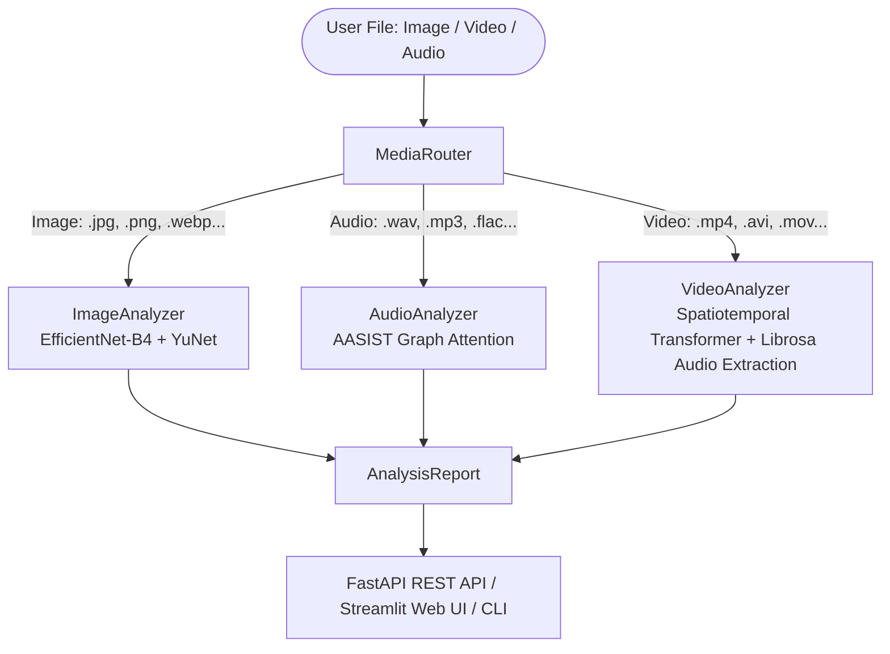

# 📐 DeepFake Media Detector — Architecture Specification

## Overview

The DeepFake Media Detector is an AI-powered static media classification system for Image, Video, and Audio content.

## Modality Subsystems

### 1. Audio Deepfake Detection (AASIST)
- **Model**: Audio Anti-Spoofing using Integrated Spectro-Temporal Graph Attention Networks.
- **Dataset**: ASVspoof 2019 Logical Access (LA).
- **Performance**: 99.71% accuracy, 0.52% Equal Error Rate (EER).
- **Input**: Raw 1D waveform, 16,000 Hz, 64,600 samples.

### 2. Video Deepfake Detection (EfficientNet-B4 + Transformer)
- **Model**: EfficientNet-B4 spatial backbone + Sinusoidal Positional Encoding + Multi-Head Temporal Self-Attention.
- **Dataset**: FaceForensics++ (FF++).
- **Preprocessing**: Uniform sampling of 16 frames, YuNet ONNX face detection, 20% margin adaptive cropping, 224×224 ImageNet normalization.

### 3. Image Deepfake Detection
- **Model**: Single-frame mode using EfficientNet-B4 spatial backbone.
- **Preprocessing**: YuNet face detection and 224×224 resolution cropping.

### 4. Multimodal Fusion
- When video files contain audio tracks, the system computes:
  $$\text{Score}_{\text{final}} = 0.6 \times \text{Score}_{\text{audio}} + 0.4 \times \text{Score}_{\text{video}}$$
- **Decision Thresholds**:
  - $\ge 0.70 \rightarrow \text{FAKE}$
  - $\le 0.30 \rightarrow \text{REAL}$
  - Otherwise $\rightarrow \text{UNCERTAIN}$
